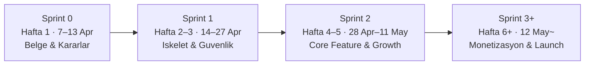

# RefinUp — Master Analysis Report
> Generated: 2026-04-06 | Leads: 5 | Categories: 11 | Mode: Lead Orchestrator

---

## Executive Summary

- **Genel puan: 1.5/10** (agirlikli ortalama; proje pre-code asamasinda)
- **Su anki durum:** Kod yok, mimari karar verilmemis, belgeler eksik — saf fikir asamasi
- **En guclu alan:** Competitive Analysis (2/10) — benzersiz "AI debate chain" konsepti, dogrudan rakip yok, first-mover firsati mevcut
- **En zayif alan:** UI/UX, Content, Accessibility, SEO, Growth, Analytics (hepsi 1/10) — sifirdan insa edilmesi gereken alanlar
- **Acil aksiyon sayisi: 20** (asagida onceliklendirilmis)
- **Kritik risk:** OpenRouter API key'in frontend'e sizmasi, zincirli prompt injection, Firebase default rules — bunlar MVP oncesi cozulmezse lansman yapilamaz

**Tek cumle ozet:** RefinUp'in fikri benzersiz ve pazar bos; **3-6 aylik first-mover penceresi kapanmadan** backend proxy (BFF), event taxonomy ve design system Sprint 0'da kurulmazsa teknik borc birikir ve Poe/Perplexity gibi rakipler yakalayabilir.

---

## Puan Karti

| # | Kategori | Lead | Worker Agent(ler) | Model | Puan | Kritik Bulgu | En Onemli Iyilestirme |
|---|----------|------|-------------------|-------|------|-------------|----------------------|
| 1 | UI/UX Design | A9 ArtLead | B3 Frontend Coder + D1 UI/UX Researcher | Sonnet | 1/10 | Design system, step indicator, streaming state sifir | Diff view (tur karsilastirma) en riskli UX karari |
| 2 | Performance | A10 CodeLead | B12 Performance Optimizer | Sonnet | N/A (4-8) | SSE streaming + Flutter WASM kritik | AI response cache + isolate kullanimi |
| 3 | SEO | A11 GrowthLead | H5 SEO Agent | Haiku | 1/10 | Domain, sitemap, structured data sifir | GEO (LLM citation) ilk gunden oncelik |
| 4 | Architecture & Code | A10 CodeLead | B1 Backend Architect + B8 Refactor | Opus | N/A (3-9) | Platform/backend karari verilmemis | Flutter + Supabase + server-side proxy |
| 5 | Monetization | A12 BizLead | H3 Revenue Analyst + H4 Pricing Strategist | Sonnet | 2/10 | Freemium limitleri ve maliyet hesabi yok | Reverse trial 2-3x konversiyon potansiyeli |
| 6 | Growth & Engagement | A11 GrowthLead | H7 Social Media + H9 Newsletter | Sonnet | 1/10 | Viral loop mekanizmasi yok | Shareable output URL en buyuk growth lever |
| 7 | Security & Infra | A13 SecLead | B13 Security Auditor + C2 Scanner | Opus | 3/10 | API key ifsa, prompt injection, Firebase rules | Backend proxy (BFF) zorunlu |
| 8 | Content Strategy | A9 ArtLead | H8 Content Repurposer | Haiku | 1/10 | Marka sesi, microcopy kilavuzu yok | AI cikti cerceveleme dili olmadan gelistirme baslanamaz |
| 9 | Analytics & Tracking | A11 GrowthLead | M3 A/B Test + M4 Analytics Agent | Sonnet | 1/10 | Event taxonomy tanimlanmamis | "Aha moment" = ilk basarili refinement |
| 10 | Accessibility | A9 ArtLead | D8 Mockup Reviewer | Haiku | 1/10 | WCAG hedefi belirlenmemis | Semantics API kullanimi zorunlu |
| 11 | Competitive Analysis | A12 BizLead | H2 Competitor + K1 Researcher + K4 Trend | Sonnet | 2/10 | Dogrudan rakip yok ama pencere dar (3-6 ay) | "Echo chamber" karsiti konumlandirma |

---

## Departman Ozetleri

### A9 ArtLead (UI/UX, Content, Accessibility)

**Kapsam:** 3 kategori — hepsi 1/10.

**Ana tespitler:**
- Design system (token, renk, tipografi, spacing) sifirdan kurulmali; shadcn_flutter veya Material 3 temelli
- Multi-step AI akisinin UX'i en erken sprintte kararlastirilmali — step indicator, streaming state, diff view
- Marka sesi 3-5 kelimelik voice pillar ile tanimlanmali; microcopy kilavuzu koddan once yazilmali
- WCAG 2.1 AA hedefi ilan edilmeli; Flutter Semantics API her custom widget'ta kullanilmali
- Karsilastirmali gorunum (diff view) hem en degerli hem en riskli ozellik — screen reader icin linearized okuma modu zorunlu

**Eskalasyon:** "AI cikti cerceveleme dili" (her turun ustune ne yazilir?) tanimlanmadan kodlama baslatilmamali.

### A10 CodeLead (Performance, Architecture)

**Kapsam:** 2 kategori — puan verilemez (kod yok) ancak mimari kararlar kritik.

**Ana tespitler:**
- **Stack onerisi:** Flutter + Supabase (PostgreSQL iliskisel veri + RLS kota yonetimi)
- **OpenRouter entegrasyonu:** Server-side proxy zorunlu; SSE ile streaming; frontend'den dogrudan API cagrisi ASLA
- Sequential AI pipeline'da her tur biter bitmez kismi sonuc stream edilmeli — toplam sure N*T'den dusurulmeli
- Flutter WASM renderer web performansi icin zorunlu; LCP < 2.5s hedefi
- Kod organizasyonu: feature-first klasor yapisi + Riverpod state management
- Hata yonetimi: retry (3x), fallback model, kullaniciya devam/iptal secenegi

**Eskalasyon:** Platform/backend karari verilmeden hicbir kategori ilerleyemez — bu Sprint 0 Day 1 karari.

### A11 GrowthLead (SEO, Growth, Analytics)

**Kapsam:** 3 kategori — hepsi 1/10.

**Ana tespitler:**
- **Shareable output URL** SEO + Growth + Analytics ucunu birden besliyor — tek bir ozellik uc departmani etkiliyor
- GEO (Generative Engine Optimization) ilk gunden oncelik; LLM referrer kullanicilari 4.4x daha yuksek donusum
- Event taxonomy koddan once yazilmali — sonradan eklemek veri tutarsizligina yol acar
- "Aha moment" = ilk basarili refinement tamamlama; Day 7 retention %40+ hedef
- PostHog onerisi: open-source, KVKK dostu, A/B test built-in
- Viral loop: "Before & After" formati (ham fikir vs rafine fikir) sosyal medyada viral potansiyeli yuksek
- Product Hunt + Hacker News launch stratejisi planlanmali

**Eskalasyon:** Shareable URL olmadan viral buyume mumkun degil; bu ozellik MVP scope'unda olmali.

### A12 BizLead (Monetization, Competitive)

**Kapsam:** 2 kategori — 2/10.

**Ana tespitler:**
- **Fiyatlandirma:** Free (3 tur/gun) → Pro $15/ay (50 tur) → Creator $29/ay (200 tur) → Team $49/kullanici/ay
- **Maliyet:** Tur basi ~$0.08 (2 model) ile ~$0.20 (tum modeller) arasi; Pro tier %33-73 marj
- **Reverse trial** (14 gun tam erisim → kisitli) konversiyon %2-5'ten %8-12'ye cikarabilir
- Hybrid model (subscription + credit) onerisi; Stripe veya RevenueCat
- **Rekabet:** Dogrudan rakip yok, ancak Poe/Perplexity 3-6 ay icinde benzer ozellik ekleyebilir
- Konumlandirma: "Tek model seni onaylar. RefinUp seni gelistirir." — echo chamber karsiti mesaj
- Birincil hedef kitle: erken asama girisimciler > urun yoneticileri > yazarlar > arastirmacilar

**Eskalasyon:** Maliyet hesabi yapilmadan freemium acilmamali — sinirsiz tur vaat edilirse LLM maliyeti kontrol disi cikar.

### A13 SecLead (Security & Infrastructure)

**Kapsam:** 1 kategori — 3/10.

**Ana tespitler:**
- **3 Critical risk:** (1) OpenRouter API key client-side ifsa, (2) Zincirli prompt injection, (3) Firebase default rules
- Backend proxy (BFF) zorunlu — tum AI cagrilari server uzerinden
- Denial of Wallet saldirisi: per-user rate limiting + gunluk maliyet tavani + CAPTCHA
- KVKK/GDPR: acik riza, DPIA, veri silme hakki, DPA (OpenRouter ile) gerekli
- Her AI turu arasinda context temizleme — zincirli injection yuzeyini daralt
- Firebase Security Rules + App Check ilk deploy'dan once yazilmali
- Prompt uzunluk limiti (5000 karakter) + input sanitization

**Eskalasyon:** Firebase `allow read, write: if true` ile ASLA deploy edilmemeli. API key frontend'e ulasirsa fatura felaket boyutunda olabilir.

---

## Top 20 Oncelikli Aksiyonlar

| # | Aksiyon | Kategori | Lead | Etki | Efor | Oncelik |
|---|---------|----------|------|------|------|---------|
| 1 | Flutter + Supabase stack kararini confirm et, proje iskeletini kur | Architecture | A10 | Critical | S | P0 |
| 2 | Backend proxy (BFF) mimarisi tasarla — OpenRouter API key sadece server'da | Security + Architecture | A13 + A10 | Critical | M | P0 |
| 3 | SSE streaming pipeline kur — AI yanitlari chunk chunk aksin | Performance | A10 | Critical | M | P0 |
| 4 | Firebase Security Rules + App Check yaz (ilk deploy oncesi) | Security | A13 | Critical | S | P0 |
| 5 | Event taxonomy belgesini koddan once yaz | Analytics | A11 | High | S | P0 |
| 6 | Design system tokenlarini tanimla (renk, tipografi, spacing — dark/light) | UI/UX | A9 | High | M | P0 |
| 7 | Marka sesi (brand voice) + microcopy kilavuzu olustur | Content | A9 | High | S | P0 |
| 8 | Freemium tier limitlerini + maliyet hesabini netlesir | Monetization | A12 | High | S | P0 |
| 9 | Per-user rate limiting + gunluk maliyet tavani implement et | Security | A13 | Critical | M | P1 |
| 10 | Step indicator + streaming state UI tasarimi | UI/UX | A9 | High | S | P1 |
| 11 | Shareable output URL (/idea/[id]) ozelligini MVP scope'una al | Growth + SEO | A11 | High | M | P1 |
| 12 | WCAG 2.1 AA hedefini ilan et, Semantics API kurallarini belirle | Accessibility | A9 | High | S | P1 |
| 13 | Prompt injection onlemi: input sanitization + context temizleme + structured output | Security | A13 | Critical | M | P1 |
| 14 | Supabase schema: users, sessions, rounds, user_quotas tablolari | Architecture | A10 | High | M | P1 |
| 15 | Domain al, landing page deploy et (sitemap + meta + OG tags) | SEO | A11 | High | S | P1 |
| 16 | PostHog / Amplitude entegrasyonunu sec ve kur | Analytics | A11 | High | S | P1 |
| 17 | 3 adimli onboarding flow tasarla | Growth + UI/UX | A11 + A9 | High | M | P2 |
| 18 | Reverse trial (14 gun) stratejisini planla | Monetization | A12 | High | M | P2 |
| 19 | "Echo chamber karsiti" konumlandirma + landing page copy | Competitive | A12 | High | S | P2 |
| 20 | Product Hunt + Hacker News launch stratejisini planla | Growth | A11 | High | S | P2 |

---

## Cross-Cutting Insights

### 1. Shareable URL — 3 Lead'in ortak onceligi
**A11 GrowthLead**, **A11 SEO** ve **A9 ArtLead** uc farkli acidan ayni sonuca ulasiyor: paylasilabilir output URL'i (`/idea/[id]`) olmadan viral buyume, UGC SEO ve analytics attribution mumkun degil. Bu tek ozellik buyume motorunun temelidir.

### 2. Backend Proxy (BFF) — 3 Lead'in zorunlu gorduegu mimari karar
**A13 SecLead** (API key ifsa riski), **A10 CodeLead** (SSE streaming mimarisi) ve **A12 BizLead** (maliyet kontrolu) backend proxy olmadan ilerlenemeyecegini bagimsiz olarak raporluyor. Bu Sprint 0 kararidir.

### 3. "Koddan Once Belge" Konsensüsü
**A11 GrowthLead** (event taxonomy), **A9 ArtLead** (microcopy kilavuzu + design tokens) ve **A12 BizLead** (maliyet hesabi) — uc farkli Lead "once belge, sonra kod" diyor. Bu pre-code asamasinin en onemli ciktisi belgelerdir.

### 4. Maliyet Kontrolu — Security + Monetization kesisimi
**A13 SecLead** "Denial of Wallet" saldirisi, **A12 BizLead** "maliyet hesabi yapilmadan freemium acilmamali" — ikisi de ayni risk: kontrolsuz AI API maliyeti. Per-user rate limiting hem guvenlik hem is modeli icin zorunlu.

### 5. Zincirli Pipeline — Hem En Buyuk Deger Hem En Buyuk Risk
RefinUp'in temel ozelligi (AI-1 → AI-2 → AI-3 zinciri) ayni zamanda en buyuk guvenlik riski (zincirli prompt injection) ve en buyuk UX zorlugudu (streaming state, diff view). Bu ozellik tasarimdan kodlamaya kadar her asamada ozel dikkat gerektirir.

### 6. First-Mover Penceresi Dar
**A12 BizLead** 3-6 ay icinde Poe/Perplexity'nin benzer ozellik ekleyebilecegini raporluyor. **A10 CodeLead** mimari kararlarin gecikmesinin her seyi blokladigini soyluyor. Hiz kritik.

---

## Sprint Onerisi

### Sprint 0 — Temel Kararlar ve Belgeler (Hafta 1 · 7 Apr–13 Apr)
> Amac: Kod yazmadan once tum kritik kararlari al, belgeleri olustur.

- [ ] Flutter + Supabase stack kararini confirm et
- [ ] Backend proxy (BFF) mimari semayi ciz
- [ ] Design system tokenlari tanimla (Figma veya kod)
- [ ] Event taxonomy belgesini yaz
- [ ] Marka sesi + microcopy kilavuzu olustur
- [ ] Freemium tier limitleri + maliyet tablosu olustur
- [ ] WCAG 2.1 AA hedefini ilan et
- [ ] Domain al

### Sprint 1 — Iskelet ve Guvenlik Temeli (Hafta 2–3 · 14 Apr–27 Apr)
> Amac: Calisir iskelet; guvenlik temeli; tek bir fikir submit edip AI yanit alabilme.

- [ ] Flutter proje iskeleti (feature-first klasor yapisi + Riverpod)
- [ ] Supabase schema: users, sessions, rounds, user_quotas
- [ ] Backend proxy (Edge Function) — OpenRouter'a SSE streaming
- [ ] Firebase Security Rules + App Check
- [ ] Per-user rate limiting + maliyet tavani
- [ ] Input sanitization + prompt uzunluk limiti
- [ ] Temel auth (Google + email)
- [ ] Ilk AI turu: tek model, tek tur, streaming yanit
- [ ] PostHog / analytics entegrasyonu
- [ ] Sentry error tracking

### Sprint 2 — Core Feature + Growth Temeli (Hafta 4–5 · 28 Apr–11 May)
> Amac: Multi-tur AI zinciri, shareable URL, landing page.

- [ ] Multi-tur sequential pipeline (2-4 tur)
- [ ] AI rol sistemi (elestirmen, iyimser, pragmatist)
- [ ] Step indicator + streaming state UI
- [ ] Shareable output URL (/idea/[id])
- [ ] Landing page + SEO temeli (meta, OG, sitemap, structured data)
- [ ] Onboarding flow (3 adim)
- [ ] Freemium limit gostergesi + paywall
- [ ] Zincirli prompt injection onlemleri
- [ ] Temel a11y: Semantics labels, klavye navigasyonu, kontrast

### Sprint 3+ — Buyume ve Monetizasyon (Hafta 6+ · 12 May itibaren)
> Amac: Odeme, viral loop, launch.

- [ ] Stripe entegrasyonu + reverse trial
- [ ] Referral sistemi
- [ ] Before & After paylasim formati
- [ ] Product Hunt / Hacker News launch
- [ ] E-posta onboarding serisi (D1, D3, D7)
- [ ] A/B test altyapisi (PostHog feature flags)
- [ ] Diff view (tur karsilastirma)
- [ ] GEO optimizasyonu (structured content, FAQ schema)

---

## Yol Haritasi

### Genel Bakis

> Her faz bir sonrakinin onkosuldur. Sprint 0 belgeler olmadan Sprint 1 baslayamaz; BFF olmadan Sprint 2'nin core feature'i guvensizdir.

### Faz Detaylari

| Faz | Takvim | Sure | Hedef | Ana Ciktilar | Blokorler |
|-----|--------|------|-------|-------------|-----------|
| Sprint 0 | 7–13 Apr | 1 hafta | Temel kararlar & belgeler | Stack karari, BFF mimarisi, design tokens, event taxonomy, marka sesi, maliyet tablosu | Takim uyumsuzlugu; karar gecikmesi |
| Sprint 1 | 14–27 Apr | 2 hafta | Calisir iskelet & guvenlik temeli | Auth, DB schema, backend proxy, rate limiting, ilk AI turu (streaming), analytics | Sprint 0 belgeleri eksikse baslatilamaz |
| Sprint 2 | 28 Apr–11 May | 2 hafta | Core feature & buyume temeli | Multi-tur pipeline, shareable URL, landing page, onboarding, paywall | BFF olmadan core feature deploy edilemez |
| Sprint 3+ | 12 May+ | Surekli | Monetizasyon & lansman | Stripe, reverse trial, Product Hunt, GEO, diff view | Shareable URL Sprint 2'de bitmezse viral loop gecikir |

### Milestone Checklist

**Sprint 0 Tamamlandi mi?**
- [ ] Stack karari dokumante edildi (Flutter + Supabase)
- [ ] BFF mimarisi cizildi ve onaylandi
- [ ] Design token dosyasi olusturuldu
- [ ] Event taxonomy belgesi yazildi
- [ ] Marka sesi & microcopy kilavuzu yazildi
- [ ] Freemium maliyet tablosu hazir
- [ ] Domain alinip DNS ayarlari yapildi

**Sprint 1 Tamamlandi mi?**
- [ ] Flutter iskelet repo'ya push edildi
- [ ] Supabase schema deploy edildi (users, sessions, rounds, user_quotas)
- [ ] Backend proxy (Edge Function) calisir durumda
- [ ] Firebase Security Rules + App Check aktif
- [ ] Rate limiting + maliyet tavani test edildi
- [ ] Ilk end-to-end AI turu demo edildi (streaming)
- [ ] PostHog dashboard aktif

**Sprint 2 Tamamlandi mi?**
- [ ] Multi-tur pipeline (min 2 tur) calisir
- [ ] Shareable URL olusturuluyor ve aciliyor
- [ ] Landing page canli (meta + OG + sitemap)
- [ ] Onboarding flow test edildi
- [ ] Paywall gorunuyor (limit asildigi anda)

**Sprint 3+ Lansmanı Hazir mi?**
- [ ] Stripe odeme akisi test edildi
- [ ] Reverse trial (14 gun) aktif
- [ ] Product Hunt profili olusturuldu
- [ ] Before & After paylasim akisi calisir

---

## Methodology & Cost Report

| # | Kategori | Lead | Worker Agent(ler) | Model | Tahmini Tool Call | Tahmini Token |
|---|----------|------|-------------------|-------|------------------|---------------|
| 1 | UI/UX Design | A9 ArtLead | B3 Frontend Coder + D1 UI/UX Researcher | Sonnet | ~15 | ~25K |
| 2 | Performance | A10 CodeLead | B12 Performance Optimizer | Sonnet | ~12 | ~20K |
| 3 | SEO | A11 GrowthLead | H5 SEO Agent | Haiku | ~10 | ~12K |
| 4 | Architecture & Code | A10 CodeLead | B1 Backend Architect + B8 Refactor Agent | Opus | ~20 | ~40K |
| 5 | Monetization | A12 BizLead | H3 Revenue Analyst + H4 Pricing Strategist | Sonnet | ~15 | ~25K |
| 6 | Growth & Engagement | A11 GrowthLead | H7 Social Media + H9 Newsletter | Sonnet | ~15 | ~25K |
| 7 | Security & Infra | A13 SecLead | B13 Security Auditor + C2 Security Scanner | Opus | ~20 | ~40K |
| 8 | Content Strategy | A9 ArtLead | H8 Content Repurposer | Haiku | ~10 | ~12K |
| 9 | Analytics & Tracking | A11 GrowthLead | M3 A/B Test + M4 Analytics Agent | Sonnet | ~15 | ~25K |
| 10 | Accessibility | A9 ArtLead | D8 Mockup Reviewer | Haiku | ~10 | ~12K |
| 11 | Competitive Analysis | A12 BizLead | H2 Competitor + K1 Researcher + K4 Trend | Sonnet | ~18 | ~30K |
| — | **Master Analysis** | **A1 Master** | — | **Opus 4.6** | ~15 | ~50K |
| | **TOPLAM** | | | | **~175** | **~316K** |

---

> **Son soz:** RefinUp'in en buyuk avantaji pazarda dogrudan rakibinin olmamasi. En buyuk riski ise bu firsati degerlendirmek icin gereken hizda hareket edememek. Sprint 0'daki belge calismalari ve mimari kararlar, Sprint 1'den itibaren hizli ve guvenli gelistirmenin onkosulu.
